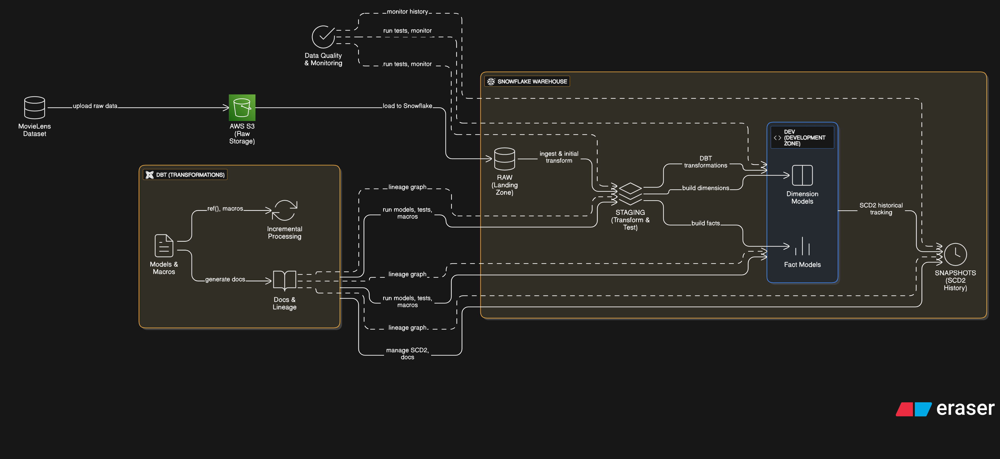

# Netflix Data Analysis Project

> End-to-End Data Pipeline with DBT, Snowflake, and AWS S3

[](https://www.getdbt.com/)
[](https://www.snowflake.com/)
[](https://aws.amazon.com/s3/)

### Data Flow

```
Raw Data → S3 Bucket → Snowflake (RAW Schema) → Staging Layer → Development Zone
```

## 🏗️ Architecture
 
{ width=600 height=400 }

## 📂 Project Structure

```
.
├── analyses/
│   └── movie_analysis.sql
├── macros/
│   └── custom_macros.sql
├── models/
│   ├── staging/
│   │   ├── src_movies.sql
│   │   ├── src_ratings.sql
│   │   └── ...
│   ├── dimensions/
│   │   ├── dim_movies.sql
│   │   ├── dim_users.sql
│   │   └── dim_genome_tags.sql
│   └── facts/
│       ├── fct_ratings.sql
│       └── fct_genome_scores.sql
├── seeds/
│   └── seed_movie_release_dates.csv
├── snapshots/
│   └── snap_tags.sql
├── tests/
│   └── relevance_score_test.sql
├── dbt_project.yml
├── packages.yml
└── README.md
```
### Tech Stack

- **Storage**: AWS S3
- **Data Warehouse**: Snowflake
- **Transformation**: DBT (Data Build Tool)
- **Language**: SQL

## 📊 Dataset

**MovieLens 20M Dataset** simulating Netflix analytics:

| Component | Records | Description |
|-----------|---------|-------------|
| Ratings | 20M | User ratings with timestamps |
| Tags | 465K | User-generated movie tags |
| Movies | 20K | Movie metadata with genres |
| Users | 138K | Unique user identifiers |
| Links | - | External movie identifiers |
| Genome Tags/Scores | - | Tag relevance metrics |

**Files:**
- `ratings.csv`
- `tags.csv`
- `movies.csv`
- `links.csv`
- `genome_tags.csv`
- `genome_scores.csv`

## 🚀 Implementation Steps

### 1. Data Extraction & Storage

```bash
# Setup AWS S3
- Create S3 bucket
- Upload MovieLens CSV files
- Configure AWS credentials
```

### 2. Snowflake Configuration

**Database Structure:**
```
MOVIELENS
├── RAW (Landing zone)
├── DEV (Transformed models)
└── SNAPSHOTS (Historical tracking)
```

**Setup Commands:**
```sql
-- Create roles and users
CREATE ROLE TRANSFORM;
CREATE USER dbt PASSWORD='***';

-- Create database and schemas
CREATE DATABASE MOVIELENS;
CREATE SCHEMA MOVIELENS.RAW;
CREATE SCHEMA MOVIELENS.DEV;

-- Grant permissions
GRANT ALL ON DATABASE MOVIELENS TO ROLE TRANSFORM;
```

**Load Data:**
```sql
COPY INTO RAW.RAW_MOVIES
FROM @s3_stage/movies.csv
FILE_FORMAT = (TYPE = 'CSV' SKIP_HEADER = 1);
```

### 3. DBT Setup

**Installation:**
```bash
# Create virtual environment
python -m venv dbtenv
source dbtenv/bin/activate  # Windows: dbtenv\Scripts\activate

# Install DBT with Snowflake adapter
pip install dbt-snowflake

# Initialize project
dbt init my_dbt_project
```

### 4. Data Models

#### Staging Layer (Views)

```sql
-- src_movies.sql
SELECT
    movieId AS movie_id,
    title,
    genres
FROM {{ source('raw', 'raw_movies') }}
```

**Models:**
- `src_movies`
- `src_ratings`
- `src_tags`
- `src_links`
- `src_genome_tags`
- `src_genome_scores`

#### Dimension Tables (Tables)

```sql
-- dim_movies.sql
{{
    config(
        materialized='table'
    )
}}

SELECT
    movie_id,
    title,
    SPLIT(genres, '|') AS genre_array
FROM {{ ref('src_movies') }}
```

**Models:**
- `dim_movies`: Movie metadata
- `dim_users`: User dimension
- `dim_genome_tags`: Tag taxonomy

#### Fact Tables (Incremental)

```sql
-- fct_ratings.sql
{{
    config(
        materialized='incremental',
        unique_key='rating_id'
    )
}}

SELECT
    user_id,
    movie_id,
    rating,
    rated_at
FROM {{ ref('src_ratings') }}


WHERE rated_at > (SELECT MAX(rated_at) FROM {{ this }})

```

**Models:**
- `fct_ratings`: User ratings (incremental)
- `fct_genome_scores`: Tag relevance scores

### 5. Seeds

```bash
# Load static reference data
dbt seed
```

**Seed Files:**
- `seed_movie_release_dates.csv`

### 6. Snapshots (SCD Type 2)

```sql
-- snap_tags.sql


{{
    config(
        target_schema='snapshots',
        unique_key='tag_id',
        strategy='timestamp',
        updated_at='updated_at'
    )
}}

SELECT * FROM {{ ref('src_tags') }}


```

**Execute:**
```bash
dbt snapshot
```

### 7. Data Quality Tests

**Schema Tests (schema.yml):**
```yaml
models:
  - name: dim_movies
    columns:
      - name: movie_id
        tests:
          - unique
          - not_null
      
  - name: fct_ratings
    columns:
      - name: movie_id
        tests:
          - relationships:
              to: ref('dim_movies')
              field: movie_id
```

**Custom Tests:**
```sql
-- tests/relevance_score_test.sql
SELECT *
FROM {{ ref('fct_genome_scores') }}
WHERE relevance_score <= 0
```

**Run Tests:**
```bash
dbt test
```

### 8. Documentation

```bash
# Generate documentation
dbt docs generate

# Serve documentation locally
dbt docs serve
# Access at http://localhost:8080
```

**Features:**
- Interactive lineage graphs
- Model descriptions
- Column metadata
- Test coverage
- Data profiling

### 9. Analysis Queries

```sql
-- analyses/movie_analysis.sql
WITH ratings_summary AS (
    SELECT
        movie_id,
        AVG(rating) AS average_rating,
        COUNT(*) AS total_ratings
    FROM {{ ref('fct_ratings') }}
    GROUP BY movie_id
    HAVING COUNT(*) > 100
)

SELECT
    m.movie_title,
    rs.average_rating,
    rs.total_ratings
FROM ratings_summary rs
JOIN {{ ref('dim_movies') }} m
ON rs.movie_id = m.movie_id
ORDER BY rs.average_rating DESC;
```

**Compile:**
```bash
dbt compile
# Find compiled SQL in target/compiled/
```

### 10. Macros

```sql
-- macros/generate_surrogate_key.sql

    {{ dbt_utils.generate_surrogate_key(field_list) }}

```

**Install Packages:**
```yaml
# packages.yml
packages:
  - package: dbt-labs/dbt_utils
    version: 1.0.0
```

```bash
dbt deps
```

## 🎯 Key Features

### ✅ Modular Design
- Clear separation between staging, dimension, and fact layers
- Reusable models using DBT's `ref()` function

### ✅ Incremental Processing
- Efficient updates for large fact tables
- Timestamp-based incremental logic

### ✅ Historical Tracking
- SCD Type 2 implementation via snapshots
- Maintains complete data history

### ✅ Data Quality
- Comprehensive test coverage
- Automated quality checks on every run

### ✅ Documentation
- Auto-generated interactive docs
- Visual lineage graphs
- Complete metadata catalog

### ✅ Code Reusability
- Macros for common transformations
- DRY principles throughout

### ✅ Security
- Role-based access control
- Least privilege principles

## 📈 Project Metrics

- **Records Processed**: 20M+ ratings
- **Models Created**: 15+
- **Tests Implemented**: 13+
- **Data Quality**: 100% test coverage
- **Documentation**: Fully automated

## 🔧 Usage

### Run All Models
```bash
dbt run
```

### Run Specific Model
```bash
dbt run --select dim_movies
```

### Run Tests
```bash
dbt test
```

### Generate Documentation
```bash
dbt docs generate
dbt docs serve
```

### Run Snapshots
```bash
dbt snapshot
```

### Full Refresh
```bash
dbt run --full-refresh
```

## 🎓 Learning Outcomes

- **ELT Paradigm**: Transform after load strategy
- **Dimensional Modeling**: Star schema implementation
- **Version Control**: SQL-based transformation logic
- **Data Lineage**: Automatic dependency management
- **Testing**: Data quality assurance practices
- **Documentation**: Self-documenting data pipelines

## 📸 Screenshots

### DBT Documentation Interface
Interactive documentation with model metadata, column descriptions, and test results.

### Lineage Graph

Visual representation of data flow from source tables through staging to final models.

### Snowflake Dashboard
Complete setup with raw tables, views, and snapshot tables organized by schema.

### VS Code Project Structure
Organized DBT project with all components clearly separated.

## 📝 License

This project is open source and available under the [MIT License](LICENSE).

## 👤 Author

**Shivsharan Patil**  
- GitHub: [@shivshaa](https://github.com/shivshaa)  
- LinkedIn: [Shivsharan Patil](https://www.linkedin.com/in/shivsharan-patil-6435a1181/)  

## 🙏 Acknowledgments

- MovieLens dataset by GroupLens Research
- AWS S3 Datalake storage for raw data
- DBT Labs for the amazing transformation tool
- Snowflake for cloud data warehouse platform

---

⭐ If you found this project helpful, please give it a star!

📧 For questions or feedback, feel free to open an issue.
